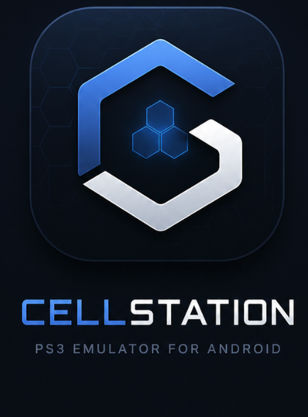

<p align="center"></p>

# CellStation — a PS3 emulator for Android handhelds

> **Based on [RPCS3](https://github.com/RPCS3/rpcs3)** — the PlayStation 3 emulator by the RPCS3 team, used under the GPL-2.0 license. This is an **unofficial, independent port**. It is **not affiliated with, endorsed by, or supported by the RPCS3 team** — please do not report issues from this project to them.

An Android port of the RPCS3 emulation core for Snapdragon-powered gaming handhelds (AYN Odin 3, Odin 2, Thor class), with a Kotlin/Jetpack Compose UI, a minimal JNI bridge, and first-class launch-intent integration for frontends like [Cocoon](https://github.com/inssekt/CocoonFE) and Daijishō.

**Status: planning / pre-alpha.** See [PLAN.md](PLAN.md) for the full porting plan, architecture, and milestones.

## Design principles

- **Upstream-first.** RPCS3 is consumed as an unmodified git submodule pinned to upstream master. Any unavoidable change lives as a reviewed patch in `patches/` with an upstreaming plan. We ride upstream's arm64 progress instead of forking away from it.
- **Thin wrappers.** Kotlin UI ↔ small JNI bridge ↔ untouched C++ core. No emulation logic outside the core.
- **Frontend-friendly.** A documented, stable Android intent contract so any launcher can boot games directly.
- **Honest.** Public compatibility expectations, full source for every release, no monetization.

## Building locally

Mirrors [.github/workflows/android-core.yml](.github/workflows/android-core.yml). Needs CMake ≥ 3.28, Ninja, an Android NDK, ccache, and the LLVM android-aarch64 prebuilt (artifact of the `llvm-android` workflow — see the header of [ci/build-local.sh](ci/build-local.sh)). On macOS: `brew install cmake ninja ccache && brew install --cask android-ndk`.

```bash
git submodule update --init --depth 1 rpcs3
```

```bash
cd rpcs3 && for m in $(git submodule status | awk '{print $2}' | grep -vE 'llvm|ffmpeg|MoltenVK'); do git submodule update --init --depth 1 "$m"; done
```

```bash
sh ci/apply-patches.sh
```

```bash
sh ci/build-local.sh
```

```bash
cd app && ./gradlew assembleDebug
```

The build script cross-compiles a static ffmpeg into `~/ffmpeg-android` (first run only), configures `native/` with the NDK toolchain (arm64-v8a, android-29, `WITH_LLVM=ON` against the prebuilt), builds `libcellstation.so`, and stages a stripped copy into `app/src/main/jniLibs/`. Override `ANDROID_NDK_HOME`, `FFMPEG_PREFIX`, `LLVM_PREBUILT`, or `BUILD_DIR` via the environment.

## GPU drivers: Turnip (recommended) and stock

CellStation can replace the device's Vulkan driver at runtime with a custom one
via bundled [libadrenotools](https://github.com/bylaws/libadrenotools) — no root
needed. On Snapdragon devices the recommended driver is **Mesa Turnip** (the
open-source freedreno Vulkan driver):

- **Noticeably faster** in our testing on an AYN Thor (Adreno 740): ~15% higher
  FPS in a heavy commercial title, identical rendering.
- **Far lower GPU memory use** (~3× in the same test). The stock Qualcomm blob
  backs command buffers and descriptor sets with GPU memory that Android never
  attributes to the app, which starves the device in long sessions; Turnip keeps
  that memory host-side like desktop Mesa.

To use it: download a Turnip build packaged for adrenotools (a zip containing
`meta.json` + the driver `.so` — e.g. from
[K11MCH1/AdrenoToolsDrivers](https://github.com/K11MCH1/AdrenoToolsDrivers/releases)
releases, Adreno 7xx builds), then in-app: **Settings → Graphics → Install GPU
driver**, pick the zip, and restart the app. The GPU driver setting cycles
between the system driver and installed ones; the active driver is logged at
startup (`Found Vulkan-compatible GPU: 'Turnip Adreno (TM) ...'`).

If a custom driver fails to load, CellStation falls back to the system driver
automatically. Driver packages are user-installed and never bundled with the
app.

## Testing with homebrew

The rpcs3 submodule ships the RPCS3 team's own homebrew test programs in `rpcs3/bin/test/` (GPL-2.0, no commercial content). Use these as boot-test payloads — never commercial games:

- `ppu_thread.elf` (139 KB) — minimal CPU/threading smoke test, no graphics.
- `gs_gcm_hello_world.elf` (343 KB) — first RSX output.
- `gs_gcm_tetris.elf` (548 KB) — smallest actual *game*: playable GCM Tetris.

Drop one into `Android/data/nu.hyperworks.cellstation/files/games/` and boot it from the app, or via the intent contract (see [docs/INTENTS.md](docs/INTENTS.md)).

Verified on the Android emulator (Pixel 3a API 34, arm64): `gs_gcm_tetris.elf` boots through ELF load → PPU LLVM recompilation → firmware SPRX loading → game code executing (its `sys_tty` output and RSX flips visible in `adb logcat -s RPCS3`). The emulator's Vulkan is rejected by the core, so it runs on the Null renderer — on-screen output needs a device with a real Vulkan driver (the Snapdragon targets).

## Attribution & license

This project is licensed under **GPL-2.0** ([LICENSE](LICENSE)), inherited from RPCS3.

- PS3 emulation: © the [RPCS3 team and contributors](https://github.com/RPCS3/rpcs3) (GPL-2.0). This project exists because of their work, including their December 2024 arm64 support effort.
- Android port code (JNI bridge, Kotlin app, build system): © contributors to this repository (GPL-2.0).
- Each release documents the exact upstream commit and patch set used (see `docs/ATTRIBUTION.md`, forthcoming).

"PlayStation" and "PS3" are trademarks of Sony Interactive Entertainment. This project is not affiliated with Sony. It does not include any game content, firmware, or copyrighted system software; users must supply their own legally-obtained firmware and games.
